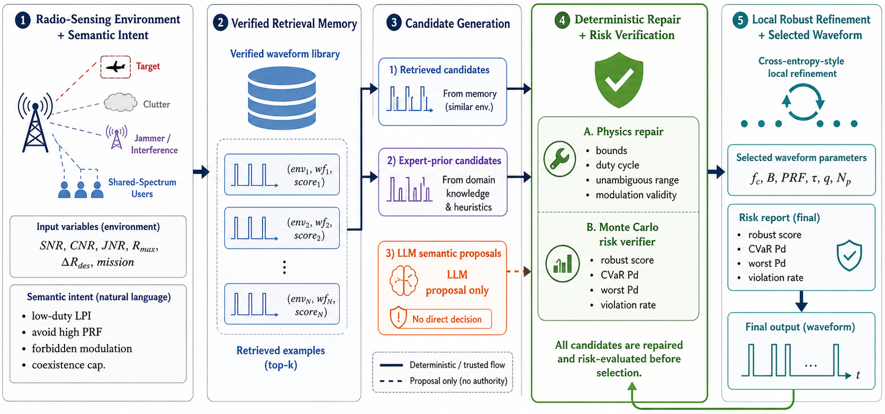

# RAG-CRA: Verifier-Guided RAG-LLM Orchestration for Cognitive Radio Sensing

This repository contains the code and experiment scripts for the paper:

**Verifier-Guided RAG-LLM Orchestration for Semantic and Risk-Aware Cognitive Radio Sensing**

RAG-CRA studies how retrieval-augmented large language models (LLMs) can be used as **semantic proposal modules** for cognitive radio sensing, while deterministic radio-domain tools perform feasibility repair, Monte Carlo risk verification, and local robust refinement.

The central design principle is:

> **LLM proposes; deterministic verifier decides.**

The overall verifier-guided RAG-CRA workflow is shown below.

<p align="center">
  
</p>
<p align="center">
  <em>RAG-CRA workflow: the LLM generates semantic proposals, while deterministic repair, Monte Carlo risk verification, and local robust refinement decide the final waveform.</em>
</p>

The LLM is not used as a stand-alone waveform optimizer.

---

## Overview

AI-enabled cognitive radio sensing systems must adapt waveform parameters under clutter, interference, spectrum coexistence requirements, and operator-level semantic intent. RAG-CRA provides a verifier-guided orchestration framework that combines:

- retrieval from a verified waveform library;
- deterministic expert-prior waveform candidates;
- LLM-generated semantic waveform proposals;
- physical feasibility repair;
- Monte Carlo sample-risk evaluation;
- local robust refinement;
- equal-budget comparisons against PSO, GA, and DE;
- semantic-constrained stress tests;
- API-integrity reporting with no silent fallback.

The framework is designed to evaluate whether LLMs are useful when they are embedded inside a physically verified decision loop rather than trusted directly.

---

## Main Features

### Verifier-guided LLM orchestration

- LLM outputs are treated only as waveform candidate proposals.
- All candidates are repaired and risk-evaluated before selection.
- The final waveform is selected by deterministic verification and robust refinement, not by the LLM.

### Risk-aware waveform selection

The benchmark reports:

- robust score;
- CVaR detection probability;
- sample worst-case detection probability;
- violation rate.

### Semantic-constrained stress testing

The semantic benchmark covers natural-language and operator-level requirements such as:

- low-probability-of-intercept (LPI) or low-duty-cycle operation;
- spectrum coexistence restrictions;
- forbidden modulation constraints;
- bandwidth caps;
- long-range sensing preferences under interference.

### Equal-budget baseline comparison

The repository includes matched-budget comparisons against:

- particle swarm optimization (PSO);
- genetic algorithm (GA);
- differential evolution (DE);
- random search;
- machine-learning policy;
- RAG-CRA without LLM proposals.

### LLM API integrity

To avoid hidden deterministic substitution, the code reports:

- successful LLM rows;
- retry count;
- parsed candidate count;
- API error count;
- fallback count.

Silent rule-based fallback is disabled in the main LLM-enabled experiments.

---

## Repository Structure

```text
.
├── radar_llm_robust/
│   ├── config.py
│   ├── experiments.py
│   ├── robust.py
│   ├── simulator.py
│   ├── semantic_stress.py
│   ├── llm_client.py
│   ├── baselines.py
│   └── ...
├── run_full_v45_pipeline.py
├── run_semantic_v45.py
├── run_equal_budget_v45.py
├── run_v45_paper_reporting.py
├── requirements.txt
├── README.md
└── outputs/
```

---

## Installation

We recommend using a clean Python environment.

### Conda

```bash
conda create -n ragcra python=3.10 -y
conda activate ragcra
pip install -r requirements.txt
```

### Python venv

Linux/macOS:

```bash
python -m venv .venv
source .venv/bin/activate
pip install -r requirements.txt
```

Windows PowerShell:

```powershell
python -m venv .venv
.\.venv\Scripts\Activate.ps1
pip install -r requirements.txt
```

---

## API Configuration

RAG-CRA uses an OpenAI-compatible chat-completions API for LLM proposal generation.

Before running LLM-enabled experiments, edit:

```text
radar_llm_robust/config.py
```

Set your API endpoint, API key, and model identifier:

```python
USE_API = True
API_URL = "YOUR_OPENAI_COMPATIBLE_CHAT_COMPLETIONS_ENDPOINT"
API_KEY = "YOUR_API_KEY"
MODEL_ID = "YOUR_MODEL_ID"
```

For reproducible LLM-integrity experiments, keep fallback disabled:

```python
REQUIRE_API_FOR_LLM_METHODS = True
ALLOW_RULE_FALLBACK_WHEN_API_FAILS = False
SEMANTIC_ALLOW_RULE_FALLBACK = False
```

---

## Running the Main Pipeline

To run the main numerical experimental pipeline:

```bash
python run_full_v45_pipeline.py
```

This generates the main benchmark results and paper-reporting outputs.

---

## Running Semantic-Constrained Stress Tests

To run semantic-constrained stress experiments:

```bash
python run_semantic_v45.py
```

Expected output directory:

```text
outputs/semantic_stress/
```

Important files include:

```text
outputs/semantic_stress/semantic_stress_results.csv
outputs/semantic_stress/semantic_stress_summary.csv
outputs/semantic_stress/semantic_paired_deltas.csv
```

---

## Running Equal-Budget PSO/GA/DE Comparisons

To run equal-budget population-optimizer baselines:

```bash
python run_equal_budget_v45.py
```

Expected output directory:

```text
outputs/equal_budget/
```

Important files include:

```text
outputs/equal_budget/all_results.csv
outputs/equal_budget/summary_all_suites.csv
outputs/equal_budget/paper_equal_budget/
```

To also include equal-budget random search:

```bash
python run_equal_budget_v45.py --include-random
```

---

## Generating Paper Tables and Figures

After running the experiments, refresh paper-ready reporting files:

```bash
python run_v45_paper_reporting.py
```

Typical output directory:

```text
outputs/paper_run/paper_v45/
```

This directory contains CSV files, LaTeX tables, and figure files used in the paper.

---

## Suggested Reproduction Workflow

A complete reproduction workflow is:

```bash
python run_full_v45_pipeline.py
python run_semantic_v45.py
python run_equal_budget_v45.py
python run_v45_paper_reporting.py
```

If main numerical results have already been generated, semantic and equal-budget experiments can be run separately without rerunning the full pipeline.

---

## Key Experimental Outputs

The paper uses the following major result groups:

1. **Matched-budget numerical benchmark**
   - Nominal benchmark
   - OOD stress benchmark
   - Equal-budget PSO/GA/DE comparison

2. **Semantic-constrained stress benchmark**
   - Rule without semantic constraints
   - Deterministic semantic rule
   - Semantic LLM proposal variant

3. **Ablation benchmark**
   - Direct LLM
   - RAG only
   - Without robust objective
   - Without refinement
   - RAG-CRA without LLM
   - Full RAG-CRA

4. **API integrity reporting**
   - Successful LLM rows
   - Retry count
   - Parsed candidate count
   - API error count
   - Fallback count

---

## Notes on Risk Metrics

The reported risk metrics are **sample-based empirical estimates** under the perturbation model used in the benchmark. They should not be interpreted as distribution-free safety certificates.

The main reported metrics are:

- robust score;
- CVaR detection probability;
- sample worst-case detection probability;
- violation rate.

